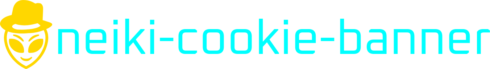

<h1 align="center">Neiki Cookie Banner</h1>

<p align="center">
  
</p>

<p align="center">
  
  
  
  
  <br>
  
  
</p>

<p align="center">
  <b>Production-ready GDPR Cookie Consent Banner</b><br>
  <i>Drop-in, fully customizable, zero dependencies.</i>
</p>

<p align="center">
  
  
  
  
  
</p>

---

## 📖 About

**neiki-cookie-banner** is a lightweight, drop-in cookie consent solution for any
website that needs to comply with GDPR, ePrivacy, and similar privacy
regulations — without dragging in a heavy third-party SDK or tying your site
to a paid SaaS.

It is built from the ground up in vanilla JavaScript with **zero dependencies**,
so it works on any stack — from a static HTML page to a WordPress theme,
Laravel app, Next.js site, or anything in between. Drop in one file and you
have a fully functional, accessible, themeable consent banner in under a
minute.

**Why use it?**

- 🚀 **Zero friction** — one `<script>` tag and a single `init()` call. No build
  pipeline, no bundler, no npm install required.
- 🪶 **Tiny footprint** — a single minified file with the CSS inlined; no
  network waterfall, no extra requests.
- 🛡 **GDPR-ready out of the box** — granular per-category consent, versioned
  records, timestamped decisions, explicit reject path, and a "Customize"
  flow that respects the user's choices.
- 🧩 **Truly customizable** — every label, color, layout, position, animation,
  and category is configurable. Define your own categories or override the
  defaults.
- 🔌 **Plays nicely with your stack** — lifecycle callbacks (`onScriptsUnlock`,
  `onAccept`, `onChange`, etc.) make it trivial to gate Google Analytics,
  Meta Pixel, or any third-party script behind user consent.
- ♿ **Accessible by default** — proper ARIA roles, focus trap, keyboard
  navigation, and reduced-motion support are built in, not bolted on.
- 🔒 **Safe** — every user-supplied string is HTML-escaped, no `eval`, no
  remote network calls, no tracking, no telemetry.
- 🆓 **MIT licensed** — free for commercial and personal use, forever.

Whether you run a personal blog, a marketing site, or a production SaaS,
neiki-cookie-banner gives you compliant consent management in minutes — and
keeps you in full control of the look, feel, and behavior.

---

## ✨ Features

- 🍪 **GDPR-friendly** — granular per-category consent, versioned and timestamped.
- 🧩 **Three layouts** — bottom/top **Bar**, corner **Box**, or centered **Modal**.
- 🎨 **Three themes** — Light, Dark, or Auto (follows the OS).
- ⚙️ **Custom categories** — add, remove, rename, lock, or pre-toggle anything.
- ⏱ **Auto-accept countdown** — optional timer with progress bar.
- 🔌 **Lifecycle callbacks** — `onAccept`, `onReject`, `onReady`, `onChange`, `onScriptsUnlock`.
- 🧱 **Web Component** — `<neiki-cookie-banner>` with full `data-*` config.
- 🔁 **Versioned consent** — bump `consentVersion` to re-prompt users.
- ♿ **Accessible** — ARIA roles, focus trap, keyboard navigation, reduced motion.
- 🔒 **XSS-safe** — every user string is escaped before injection.
- 🪶 **Lightweight** — vanilla JS, zero dependencies, ~700 lines of CSS.

---

## 📦 Installation

Pick the option that fits your project. The **bundled** builds inline the CSS
into the JS file, so a single `<script>` tag is all you need.

### 1. CDN — minified bundle (CSS included) **✨ recommended**

The fastest, simplest way to get started — one tag, no separate stylesheet:

```html
<script src="https://cdn.neiki.eu/neiki-cookie-banner/latest/neiki-cookie-banner.min.js"></script>
```

### 2. CDN — separate JS and CSS

If you prefer to load the stylesheet independently (e.g. to inline-tweak it
or preload it):

```html
<link rel="stylesheet" href="https://cdn.neiki.eu/neiki-cookie-banner/latest/neiki-cookie-banner.css">
<script src="https://cdn.neiki.eu/neiki-cookie-banner/latest/neiki-cookie-banner.js"></script>
```

### 3. Local install — minified bundle (CSS included)

Download `neiki-cookie-banner.min.js` and host it yourself:

```html
<script src="path/to/neiki-cookie-banner.min.js"></script>
```

### 4. Local install — separate JS and CSS

Drop both source files into your project — no build step, no package manager
required:

```html
<link rel="stylesheet" href="path/to/neiki-cookie-banner.css">
<script src="path/to/neiki-cookie-banner.js"></script>
```

Pre-built files (both regular and minified) are available in the `dist/`
directory of this repository.

---

## 🚀 Quick start

```html
<script>
  NeikiCookieBanner.init({
    layout: 'bar',
    position: 'bottom',
    theme: 'auto',
    privacyPolicyUrl: '/privacy',
    consentVersion: '1.0',

    onScriptsUnlock: function (categories) {
      if (categories.analytics) {
        // load Google Analytics, Plausible, etc.
      }
      if (categories.marketing) {
        // load Meta Pixel, Google Ads, etc.
      }
    }
  });
</script>
```

That's it. The banner appears on first visit, stores the user's choice in
`localStorage`, and stays hidden on subsequent visits until `consentVersion`
changes or the user re-opens it.

---

## 🧱 Web Component

Prefer markup over JavaScript? Use the custom element:

```html
<neiki-cookie-banner
  data-layout="modal"
  data-theme="auto"
  data-position="center"
  data-consent-version="1.0"
  data-privacy-policy-url="/privacy"
  data-lock-scroll="true"
  data-close-on-overlay-click="true">
</neiki-cookie-banner>
```

---

## ⚙️ Configuration

| Option | Type | Default | Description |
|---|---|---|---|
| `layout` | `'bar' \| 'box' \| 'modal'` | `'bar'` | Visual layout. |
| `position` | `string` | `'bottom'` | `top`, `bottom`, `bottom-left`, `bottom-right`, `center`. |
| `theme` | `'light' \| 'dark' \| 'auto'` | `'light'` | `auto` follows `prefers-color-scheme`. |
| `title` | `string` | `'We use cookies'` | Banner title. |
| `description` | `string` | (default copy) | Banner body text. |
| `privacyPolicyUrl` | `string` | `''` | If set, appends a link to the description. |
| `privacyPolicyText` | `string` | `'Privacy Policy'` | Link text. |
| `acceptAllText` | `string` | `'Accept All'` | Primary button label. |
| `rejectAllText` | `string` | `'Reject All'` | Reject button label. Pass `''` to hide. |
| `customizeText` | `string` | `'Customize'` | Customize button label. |
| `savePreferencesText` | `string` | `'Save Preferences'` | Prefs save label. |
| `categories` | `object` | (4 defaults) | Custom category map (see below). |
| `showAfterMs` | `number` | `300` | Delay before showing on first visit. |
| `autoAcceptAfterMs` | `number` | `0` | Auto-accept countdown (`0` disables). |
| `closeOnOverlayClick` | `boolean` | `false` | Modal: dismiss on backdrop click. |
| `lockScroll` | `boolean` | `false` | Lock body scroll while open. |
| `animationIn` | `'slide' \| 'none'` | `'slide'` | Entry animation. |
| `consentVersion` | `string` | `'1.0'` | Bump to re-prompt all users. |
| `zIndex` | `number` | `9999` | Stacking order. |
| `onAccept` | `function` | `noop` | Called on accept (all/selected). |
| `onReject` | `function` | `noop` | Called on reject. |
| `onReady` | `function` | `noop` | Called when valid stored consent exists. |
| `onChange` | `function` | `noop` | Called on every consent change. |
| `onScriptsUnlock` | `function` | `noop` | Called with allowed categories. |

### Custom categories

```js
NeikiCookieBanner.init({
  categories: {
    necessary:   { label: 'Necessary',   description: 'Essential cookies.', locked: true },
    analytics:   { label: 'Analytics',   description: 'Usage tracking.',    enabled: false },
    social:      { label: 'Social',      description: 'Social embeds.',     enabled: false },
    experiments: { label: 'A/B Testing', description: 'Feature trials.',    enabled: false }
  }
});
```

Built-in categories (`necessary`, `analytics`, `marketing`, `preferences`)
ship with emoji icons. Custom categories use a generic 📋 fallback.

---

## 📚 API reference

```js
NeikiCookieBanner.init(config)         // initialize and conditionally show
NeikiCookieBanner.show()               // re-open the banner
NeikiCookieBanner.hide()               // close the banner
NeikiCookieBanner.reset()              // clear stored consent and re-prompt
NeikiCookieBanner.getConsent()         // → { version, timestamp, categories } | null
NeikiCookieBanner.hasConsented()       // → boolean
NeikiCookieBanner.isAllowed('analytics') // → boolean
```

### Stored consent shape

```json
{
  "version": "1.0",
  "timestamp": "2026-04-29T10:15:30.123Z",
  "categories": {
    "necessary": true,
    "analytics": true,
    "marketing": false,
    "preferences": true
  }
}
```

---

## 🔁 Re-opening the banner

Add a `data-neiki-show-prefs` attribute to any element — typically a footer link
— and the banner will re-open on click:

```html
<a href="#" data-neiki-show-prefs>Cookie Settings</a>
```

No JavaScript required.

---

## 🎨 Theming

All colors and spacing are exposed as CSS custom properties on the
`.neiki-cb` root. Override them anywhere in your stylesheet:

```css
.neiki-cb {
  --neiki-cb-accent: #ec4899;
  --neiki-cb-radius: 12px;
}
```

---

## ♿ Accessibility

- `role="dialog"` with `aria-modal` and `aria-labelledby`.
- Toggle switches use `role="switch"` and live `aria-checked`.
- Modal layout traps focus and restores it on close.
- Fully keyboard-navigable.
- Honors `prefers-reduced-motion`.
- WCAG AA contrast in both themes.

---

## 🔒 Privacy & security

- Consent stored locally in `localStorage` (or in memory if unavailable).
- Zero network requests.
- Every user-supplied string is HTML-escaped before being rendered.
- The privacy policy link is rendered with `rel="noopener noreferrer"`.

---

## 🧪 Demo

Open `demo/index.html` in a browser to explore every layout, theme, custom
category configuration, auto-accept countdown, and the live consent state
inspector with an event log.

---

## 📄 License

This project is licensed under the MIT License — see the [LICENSE](LICENSE) file for details.

---

## 🤝 Contributing

Contributions are welcome — see [CONTRIBUTING.md](CONTRIBUTING.md) and the
[Code of Conduct](CODE_OF_CONDUCT.md). Bug reports and feature requests go in
the issue tracker.